# Arbitrary Code Execution (ACE) in Crash Bash

## Abstract

This work demonstrates a human-feasible method for writing and executing arbitrary code in the Japanese version of _Crash Bash_ (クラッシュ・バンディクー カーニバル). The original memory manipulation glitch, already known to the community, is first analyzed and its behavior is explained. This existing exploit is then further leveraged to allow more addresses to be NOP'd out than previously known. Subsequently, a novel technique is presented to enable navigation between these locations of interest and for searching out the specific bytes used when preforming the arbitrary code execution (ACE). A collection of notable memory addresses is compiled and their side effects when NOP'd are explained. Finally, the ACE is demonstrated by creating a TAS credits-warp speedrun route, which has been verified with physical hardware.

Note: See appendix for a list of all named variables and functions and their corresponding memory addresses

## Table of Contents

- [Arbitrary Code Execution (ACE) in Crash Bash](#arbitrary-code-execution-ace-in-crash-bash)
  - [Abstract](#abstract)
  - [Table of Contents](#table-of-contents)
  - [Manipulating Memory with the "Enter Name Menu"](#manipulating-memory-with-the-enter-name-menu)
    - [A Brief History](#a-brief-history)
    - [Navigating the "Enter Name" Menu](#navigating-the-enter-name-menu)
      - [Computing the New Cursor Index](#computing-the-new-cursor-index)
      - [A Data Redundancy Bug](#a-data-redundancy-bug)
      - [Under/Overrunning a Buffer for Fun ~~and Profit~~](#underoverrunning-a-buffer-for-fun-and-profit)
      - [Turning Code and Data into Swiss Cheese](#turning-code-and-data-into-swiss-cheese)
      - [Dealing with Multiple Character Tables](#dealing-with-multiple-character-tables)
  - [Defining and Navigating the State Space](#defining-and-navigating-the-state-space)
    - [Selecting and Inserting Characters from the Menu](#selecting-and-inserting-characters-from-the-menu)
    - [Inserting Characters in NTSC-J](#inserting-characters-in-ntsc-j)
    - [Mapping the State Space](#mapping-the-state-space)
    - [Detecting and Avoiding Hazards](#detecting-and-avoiding-hazards)
      - [Terminal Subgraphs](#terminal-subgraphs)
      - [Hardware Faults](#hardware-faults)
      - [Other Adverse Side-Effects](#other-adverse-side-effects)
  - [Routing for Arbitrary Code Execution (ACE)](#routing-for-arbitrary-code-execution-ace)
    - [Crafting the Payload](#crafting-the-payload)
    - [Primary Route](#primary-route)
      - [Gain of Function](#gain-of-function)
      - [Payload Injection](#payload-injection)
      - [Payload Execution](#payload-execution)
  - [Conclusion and Future Work](#conclusion-and-future-work)
  - [Appendix](#appendix)
    - [Notable NOP-able Addresses](#notable-nop-able-addresses)
      - [NOP Bifurcation -\> `0x800b7e0c`](#nop-bifurcation---0x800b7e0c)
      - [Negative Starting Character Count -\> `0x800b83e4` (Requires Bifurcated NOP)](#negative-starting-character-count---0x800b83e4-requires-bifurcated-nop)
      - [Modified Character Write Location -\> `0x800b7d64`](#modified-character-write-location---0x800b7d64)
      - [Alternative "up" Movement -\> `0x800b7ee4` (Requires Bifurcated NOP)](#alternative-up-movement---0x800b7ee4-requires-bifurcated-nop)
      - [Disabled "Left" Movement -\> `0x000b7e44`](#disabled-left-movement---0x000b7e44)
    - [Character Insertion Logical](#character-insertion-logical)
    - [Annotated Inputs](#annotated-inputs)
  - [Referenced Global Symbols for _Crash Bash_ (NTSC-J)](#referenced-global-symbols-for-crash-bash-ntsc-j)
    - [Available Characters](#available-characters)
      - [With use of Terminal Subgraphs - 159 Bytes](#with-use-of-terminal-subgraphs---159-bytes)
      - [Without use of Terminal Subgraphs - 157 Bytes](#without-use-of-terminal-subgraphs---157-bytes)
    - [Alternate Route(s)](#alternate-routes)
      - [Payload at `0x800c0030`](#payload-at-0x800c0030)
      - [Kernel/BIOS Region Modification](#kernelbios-region-modification)

## Manipulating Memory with the "Enter Name Menu"

### A Brief History

The existing memory manipulation glitch known to the _Crash Bash_ Speedrunning community was discovered back in approximately 2017 by **BetaM**. As documented on [speedrun.com](https://www.speedrun.com/crashbash/forums/aunak), while on the "Enter Name" menu it is possible for a user to move the menu cursor off of the menu screen. To do so, the user must simultaneously push both the down and left buttons on the D-Pad when the cursor is in the bottom leftmost corner of the menu, as demonstrated [here](https://youtu.be/0-5SsqgINto).

By precisely navigating the cursor around once it has "left" the screen, it is further possible for the user to alter the game's code. After this glitch was first discoverd, a useful series of inputs were soon found that allowed speedrunners to quickly beat individual levels or otherwise gain an advantage on their run. One list of these initially-discovered inputs and their effects can be found on an old pastebin post, linked [here](http://pastebin.com/FW0yvERt). At its core, this glitch results from a combination of a data redundancy bug that then leverages buffer under/overflow to effectively write NOPs every 168 bytes.

### Navigating the "Enter Name" Menu

In order to explain the behavior observed in this glitch, and how it can be exploited, the basic code and data responsible for menu navigation must first be understood. The "Enter Name" menu is comprised of four rows, each containing seven characters with 2 additional options, "Done" and "Cancel", listed below the rows. Furthermore, the game indicates the currently selected character by playing an animation that alternates that character between orange and yellow. The directional buttons on the D-Pad allow the user to switch which character is currently selected, and wraparounds are implemented at the edges of rows and columns. This means that if the currently selected character is in the left-most column and the user presses left on the D-Pad, the cursor will then move to the right-most end of the current row. Similarly, pressing up on the D-Pad while on the top-most row will place the cursor at the bottom of that column.

The main function of interest, referred to as `enterNameMenu()`, is responsible for checking and handling user-input when the user is prompted to enter a name for their save file. While on the "Enter Name" menu, the currently-selected character is tracked with a global variable referred to as `cursorIndex`. The `cursorIndex` is initialized to `0` when the user first enters the menu. The `0` index corresponds to the upper left-hand corner of the menu. The index of each character increases by 1 from left to right, top to bottom. Given four rows of seven characters and two menu options there are a total of 30 valid cursor indices.

#### Computing the New Cursor Index

When the user presses a direction button on the D-Pad, instead of directly modifying the current `cursorIndex` by a predefined amount, a table lookup is preformed. The table, or array, is comprised of 16 byte structs that themselves contain relevant information about the currently selected character. Critically, each struct contains four signed 8-bit integers. Each integer describes how much `cursorIndex` should be modified when the user presses a directional button on the D-Pad. For example, moving right would nominally increase the index by `1` but in the event of a wraparound the offset would be `-6`, effectively moving the cursor back to the beginning of the current row. These offsets are a key piece of the puzzle, but the crux is a data-redundancy bug.

```C
// a rough approximation of the struct that informs cursor movement and general character info
struct cursorInfo {
    uint32_t unknown32;
    char** displayStr; // a pointer to a string/char for the text that will be displayed (e.g. "DONE")
    uint16_t selectBehavior;  // what happens when the character "selects" the object at this index (an enum)
    // offsets applied to the current cursorIndex
    int8_t leftMove;   // e.g. this left is nominally 1 but -6 for the left most column for wrap around
    int8_t rightMove;
    int8_t upMove;
    int8_t downMove;
    uint16_t unknown16a;
};
```

#### A Data Redundancy Bug

Below is a simplified decompiled version of the code responsible for handling cursor movement. `controllerState1` is the state of the controller plugged into the first controller port. `cursorIndex` is, again, the globally scoped index of the currently highlighted character, and `lCursorIndex` is a locally scoped copy.

```C
// keep a local copy of the cursor's index (pulled from the global)
lCursorIndex = cursorIndex;

// left check
if ((controllerState1 & 0x80) != 0) {
    cursorIndex = cursorIndex + charTableAddr[lCursorIndex].leftMove;
}

// right check
if ((controllerState1 & 0x20) != 0) {
    cursorIndex = cursorIndex + charTableAddr[lCursorIndex].rightMove;
}

// up check
if ((controllerState1 & 0x10) != 0) {
    cursorIndex = cursorIndex + charTableAddr[lCursorIndex].upMove;
}

// down check
if ((controllerState1 & 0x40) != 0) {
    cursorIndex = cursorIndex + charTableAddr[lCursorIndex].downMove;
}
```

Note: Crucially, a copy of the current cursor index is made only once, at function initialization, before any movement operations are computed. The local `lCursorIndex` variable is not updated again, regardless of any movements/offsets applied to the global cursor index. In the event that the user presses more than one directional button at once, the original cursor index is used to compute the resulting cursor offset for _all_ movements. Thus, by carefully selecting the cursor location and directional input, it is possible to move the cursor outside of the intended area.

#### Under/Overrunning a Buffer for Fun ~~and Profit~~

With this knowledge, it is relatively easy to understand the behavior of the originally discovered bug. The "Enter Name" menu characters, displayed in four rows that each contain seven characters with two additional selection options, consists of 30 possible cursor indices. When the user places the cursor, indicated by the flashing orange and yellow animation, in the bottom left-hand corner of the menu the resulting state after entering `enterNameMenu` is as follows:

```C
cursorIndex  = 21
lCursorIndex = 21
charTableAddr[lCursorIndex].leftMove  =  6
charTableAddr[lCursorIndex].rightMove =  1
charTableAddr[lCursorIndex].upMove    = -7
charTableAddr[lCursorIndex].downMove  =  7
```

Looking at just the cursor offset it is possible to imagine this resulting cursor movement. Moving right is a simple action, and increases the cursor index by a single place. Pressing Down on the D-Pad moves the cursor further by 7 places, equaling an entire row of characters. This effectively moves the cursor down the menu a single row. Similarly, pressing Up on the D-Pad jumps the cursor back 7 places, or up a single row. Pressing Left, in order to account for the wraparound behavior, moves the cursor forward 6 spaces placing it at the end of the current row.

Thus, when pressing both Left and Down at the same time the sum of the current cursor index, Left offset, and Down offset are computed. This results in a cursor index of 34, greater than the expected limit of 30. Any future movement will now result in the above described code reading from unintended locations as the new cursor index results in reads outside the bounds of the `charTableAddr` array.

#### Turning Code and Data into Swiss Cheese

The above explains how it is possible to move the cursor outside of the menu, but the modification of existing data and code requires analyzing a separate portion of `enterNameMenu`. While alluded to previously, the key to understanding why code/data can be NOP'd is the method by which the currently-selected character animation is tracked. Below is another simplified decompiled version of `enterNameMenu`, with the only new symbol being `cursorTable`. This is the base address for an array of structs, each struct being 168 bytes in size. These structs contain various information pertinent to the currently selected character.

```C
// Disable character animation for currently selected character
(&cursorTable + cursorIndex * 0xa8) = 0;  // 0xa8 == 168

// Handle cursor update
...
// Handle other user input

// Enable character animation for currently selected character
(&cursorTable + cursorIndex * 0xa8) = 2;
```

As the comments in the code above describe, a single bit (as part of a larger 32 bit word) is used to track whether or not a character in the menu is to be animated at any given time. Upon entry `enterNameMenu` clears this flag, presumably with the assumption that some movement may be applied. Once all the movement is applied, the flag/bit which notifies other code that a corresponding character should be animated is again set. Since all of this is based off of the current value of `cursorIndex`, when `cursorIndex` is greater than its expected upper limit, or less than 0, `0` is written to the 32 bit word specified by `&cursorTable + cursorIndex * 0xa8`. This is how it is possible to NOP out an instruction (or piece of data) every 168 bytes.

#### Dealing with Multiple Character Tables

In the NTSC-U and PAL release of _Crash Bash_ there exists a single table of characters from which the user may type their save-file name. However, in the Japanese (NTSC-J) release, there exists three different character tables: two for Japanese and one for Latin characters. The currently loaded table is tracked with `curCharTable` where `0` corresponds to Hiragana, `1` to Katakana, and `2` to Latin. The NOP/animation behavior described above remains the same, but the movement when transitioning between characters is dependent on the currently loaded table. Below is an excerpt of the relevant code that is run at the start of `enterNameMenu` and the three character tables in numerical order.

```C
charTableAddr = (cursorInfo *)(&charTableLUT)[curCharTable * 5];
```

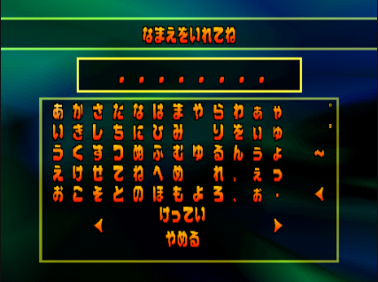

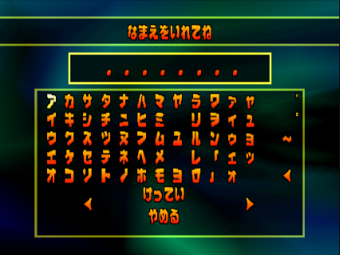

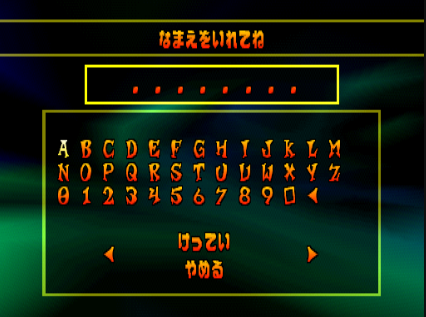

## Defining and Navigating the State Space

When looking at potential NOP addresses, it is easy enough to mathematically calculate all the addresses that can theoretically be reached by either a `0x00000000` or `0x00000002` NOP using the equations described above. However, just because these addresses are theoretically reachable this does not mean that they are practically obtainable. Recall that directional movement is entirely dependent on reading memory outside the intended bounds of an array with no guarantees of navigability. For this reason, it is vital that a method for safely navigating between addresses of interest is devised. This enables both code modification via NOPs and code generation via character insertion. This section is dedicated to examining the perils of navigating this vast and chaotic state space, while avoiding inadvertent code modification and maximizing potential code generation.

### Selecting and Inserting Characters from the Menu

As described in the previous section, computing which address can theoretically be NOP'd is a relatively straight forward process. While it is possible that these may provide conditions sympathetic to arbitrary code execution, generating the actual code to be executed is an entirely separate challenge. Given that the player already has the ability to write a set of pre-defined characters to a limited space in memory when prompted to enter a save name, this in an excellent entry-point for writing the code that will be executed as part of the ACE. For this reason, the mechanics behind inserting a character into the "name save" string will be analyzed.

In all versions of the game, the `enterNameMenu` function can be broken down into four parts:

1. **Initialization** - Initializing stack/registers and disabling animation of the character currently selected
2. **D-Pad Handling** - Evaluates the cursor's new position based on the current position and the state of the controller in port 1
3. **Button Pad Handling** - Evaluates the state of the buttons including whether a character should be deleted, added, modified, table changed, or menu exited
4. **Cleanup** - Animation is re-enabled for the currently selected character, registers/stack are restored, function returns

Having covered 1, 2, and 4 of the above in the previous sections, the handling of the buttons will be covered in this section. Unique to the NTSC-J version, before character selection is handled a check is made to see if the "triangle" button is pressed. In the event there are more than 0 characters currently in the "name save" string, a single character will be removed. After which, all versions share similar code for handling the press of a "selection" button; "X" in all versions and additionally "O" in the NTSC-J version.

In the event a selection button is pressed the game then uses a switch statement to determine the next action.

```C
switch(charTableAddr[lCursorIndex].selectBehavior)
```

As seen above, which case is selected is dependent on the locally defined cursor location (post movement update), followed by a new lookup using the `selectBehavior` member. The possible options for `selectBehavior` in the NTSC-J version are as follows:

* **0/InsertCharacter** - Attempt to insert the currently selected character
* **1/Save** - Save the game and exit this menu
* **2/Cancel** - Do not save the game but exit this menu
* **3/Backspace** - Attempt to remove the current character
* **4/Space** - Attempt to insert a space
* **5/Dakuten** - Attempt to modify the currently selected character with a dakuten ◌゙ (ascii approximation ")
* **6/Handakuten** - Attempt to modify the currently selected character with a handakuten ◌゚ (ascii approximation o)
* **7/Page Left** - Move one page, or character table, to the left changing the currently displayed character set
* **8/Page Right** - Move one page, or character table, to the right changing the currently displayed character set
* **Default** - Fall through the case with no action taken skipping straight to function cleanup

While there are interesting details related to the majority of these options, the `InsertCharacter` case will be the primary focus of this section. In the NTSC-U and PAL versions, this case houses the code responsible for attempting to insert a new character into the `gameSaveNameStr`. In those versions, the code preforms bounds checking to prevent a user from entering more than eight characters, which would overwrite the current final character if the a character were inserted. However, given the complexity required to handle the Japanese character sets, the NTSC-J version passes the currently selected character on to an entirely separate function.

```C
insertCharacter(*(byte *)charTableAddr[lCursorIndex].displayStr);
```

### Inserting Characters in NTSC-J

When `insertCharacter()` is called a single byte is passed by value. This value is the first byte in the `displayStr` string, which is a member of the `cursorInfo` struct. The line-by-line specifics of this function are outside the scope of this work, but the function can generally be broken down into two sections:

1. Counting drawn characters
2. Checking and optionally inserting the new character

The counting of drawn characters is where the majority of this function's complexity comes from and is likely why the insertion behavior was refactored into its own function for the Japanese version. In both Japanese syllabaries, there exists characters whose pronunciation can be modified by adding an additional mark; the dakuten and the handakuten for katakana and hiragana respectively. While the [Wikipedia](https://en.wikipedia.org/wiki/Dakuten_and_handakuten) article will do a better job of linguistically describing their effects, the relevant information for this work is that adding these modifiers changes how an existing character looks but does not add an additional _drawn_ character.

Instead of storing and displaying all variants of these characters in the character tables, the base characters are laid out with the modifiers on the side. In memory there exists two bytes, one for each modifier, that can be placed after the base character to signify the change. Practically, the game still imposes a limit of 8 drawn characters, but in the event each one of these 8 drawn characters had a (han)dakuten modifier applied after it there would be a maximum of 16 total characters in the `gameSaveNameStr` buffer. As expected, this is the exact amount of memory (statically) allocated for the `gameSaveNameStr` buffer. Seen below is an image of the katakana table with the handakuten and dakuten characters on the far right of the table. Right of that, the `gameSaveNameStr` text can be seen with the text "LAZYハハバパ" displayed as 8 characters but stored in text as 10. Note, the `0xed` and `0xee` after the `0x9a`s which turn "ハ" into "バ" and "パ" respectively.

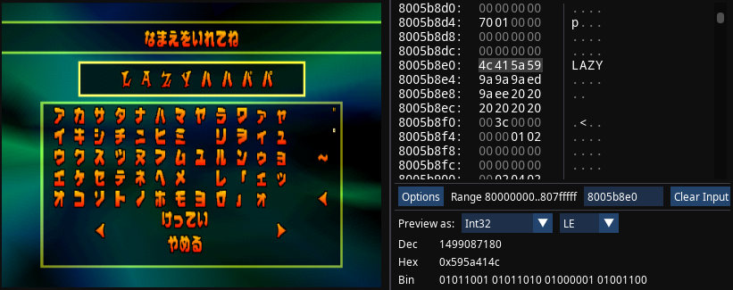

After counting the number of drawn characters, a relatively simple check is preformed to see if the newest character, `inputChar`, can be inserted into `gameSaveNameStr`. If there are less than 8 drawn characters **or** the current final character is modifiable with a (han)dakuten then `inputChar` will be added to `gameSaveNameStr`.

In summary, in order for a new character to be placed into memory (ignoring modifier characters) the following operations must occur:

1. **Selection** - Either "X" or "O" is pressed
2. **Insert Case** - The `selectBehavior` member of the struct indicated by the current cursor location must be `0`
3. **Insert Check** - There must be no more than 8 drawn characters on the screen

### Mapping the State Space

To effectively determine which addresses can be NOP'd and what characters can be written, a practical state space must be instantiated. Ideally, this state space should be static, deterministic, and readily searchable. With this in mind, a directed cyclic graph is used to model the state space. Each node of the graph corresponds to an individual cursor location. The node also contains the address(es) which would be NOP'd, the action taken if a "select" button is pressed while at this location, and which character (if any) would be inserted. The edges are simply the combination of buttons pressed to move from one node, or cursor location, to another.

To this end, a series of Python scripts have been created to define and navigate the state space. These scripts can can be found in the [tools](../tools/) directory in this repo but their implementation details and practical use are largely outside the scope of this work. What follows is a high level overview of their function to provide an idea of how the state space is created and refined.

The process begins by dumping the 2MB of PS1 RAM while in the "Enter Name" menu. This serves as the raw material from which the graph will be constructed. Python modules are used to create an API that recreates the Playstation's mirrored memory regions and facilitates simulated menu navigation. The first node of the graph is created using the starting `cursorIndex` value of `0`. From there, a simple depth first search is preformed by simulating each combination of directional inputs. When a new cursor location is encountered a new node is added to the graph. Each directional move "out" from a given node is used to define the directed edges of the graph. While theoretically an upper-bound on search depth may be required, practically the search eventually runs out of new nodes to explore after 2,616 nodes and 38,618 edges when searching with the "Hiragana" table. The resulting graph can be seen below.

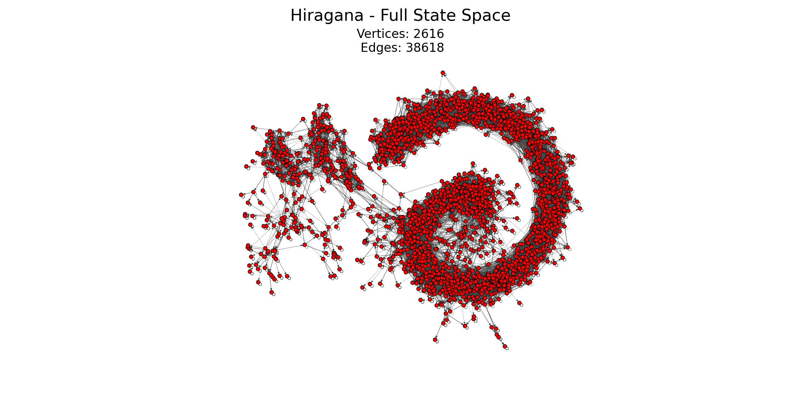

### Detecting and Avoiding Hazards

While the above graph does an excellent job of capturing the complexity of the state space, it must be trimmed to better reflect the limitations involved in graph navigation. Not only does this reduce the complexity involved in future path planning, but it can also be used to avoid trapping the cursor in unescapable subgraphs, triggering an unrecoverable hardware fault, or causing otherwise undesirable side-effects.

#### Terminal Subgraphs

Given the directed nature of the generated graph, it is conceivable there may exist one or more nodes that have incoming edges but no outgoing edges. Taking this a step further, one could imagine an entire collection of nodes forming a subgraph that, once entered, has no escape. For the sake of this work, this collection of nodes will be referred to as terminal subgraphs. In order to avoid accidentally navigating the cursor into one of these inescapable areas they must be detected and removed. This is crucial because in the NTSC-J version of the game, unlike in the NTSC-U and PAL versions, it is not possible to simply leave the menu at any time by pressing a button. The user must navigate to either a "Save" or a "Cancel" cursor location.

To remove these terminal subgraphs, they must first be identified. Detection is done using a modified version of [Tarjan's Algorithm](https://en.wikipedia.org/wiki/Tarjan%27s_strongly_connected_components_algorithm) to first enumerate the various strongly connected components of the original graph and then remove all but the largest. This ensures the cursor can never be trapped. This trimming easily results in the most consequential removal of nodes and brings the total count to 2,373 vertices and 33,886 edges corresponding to a roughly 10% reduction. A graph of the resulting state space for the "Hiragana" table with the terminal subgraphs removed can be seen below.

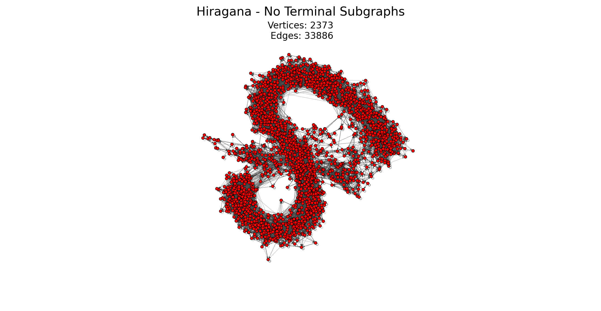

#### Hardware Faults

Despite being fewer in number, hardware faults pose perhaps a greater hazard than terminal subgraphs. While challenging, it is theoretically possible to navigate out of a terminal subgraph by carefully manipulating memory to modify the graph or by locating an "alternate" save or cancel cursor index. Hardware faults on the other hand, are unrecoverable, could be either immediate or delayed, and not nearly as identifiable. This is not to say they pose an insurmountable challenge. The first step in avoiding hardware faults is to categorize and enumerate them. For this work, hardware faults can be broken into two subcategories: **navigation** and **interaction**.

Navigation faults are simply those that occur as a result of moving the cursor to a specific location. As NOPs are an unavoidable side-effect of navigating the cursor outside its intended bounds, one must be careful not to NOP out critical regions of code. Common examples of this may include destroying an increment/decrement of the stack pointer or triggering an out-of-bounds memory access by inadvertently modifying the initialization of a register. To identify problematic NOP addresses, the NOP addresses from each node/cursor index can be taken from the graph and used to create a list of all possible NOP-able addresses. Each one of these addresses can then be individually NOP'd out and a simulation with _Bizhawk_ can be run to ensure there are no adverse effects. This brute force method is costly in time, but must only be run once to mark all dangerous cursor indices. This list is then stored in a Python module which can be referenced while building the graph to avoid adding dangerous nodes.

The second category, interaction, contains any node that if selected will cause an out-of-bounds read to be preformed. While it is possible to navigate the cursor to a sufficiently distant index as to cause an invalid read, more often than not this hazard is only present when an index is "selected". Recall, when an index is "selected" the resulting character that is inserted is the result of dereferencing a secondary pointer to the character (code below). While attempting to insert a character may cause a hardware fault, many of these nodes are still safe to traverse. For this reason, these potentially hazardous nodes are marked with a "hazard" flag but are not removed from the graph. This allows the nodes in question to remain in use and provides a way for other modules to know that a given node may not be useable for code generation.

```C
insertCharacter(*(byte *)charTableAddr[lCursorIndex].displayStr);
```

#### Other Adverse Side-Effects

The final hazards outlined in this work are a collection of side-effects that, while not fatal to the execution of the game, are undesirable while attempting to preform arbitrary code execution. The most insidious side effect occurs when a NOP modifies the address the defines the movement of another node. For example, cursor index -27, will modify one or more directional inputs for cursor index -145. In essence, this breaks the assumption of a static graph and may cause graph navigation to fail if both of these nodes are used. In order to simplify graph construction and navigation, a naive solution is to remove one of the two nodes from the final graph. This decision is treated as a trade-off and must be made on a case-by-case basis while crafting a route.

Finally, while not as insidious, there exists a number of address that when NOP'd will result in undesirable behavior. For the sake of brevity, a short list of these additional side effects has been provided. Similar to the aforementioned hazards, they have been manually identified and are optionally added to a list of addresses to be avoided during graph creation. Issues include, but are not limited to:

* Breaking character/text animation
* Music failing to play
* Player camera spinning out of control
* Modified or absent fireworks during credits

Removing all of these hazards produces the following state space for the "Hiragana" table.

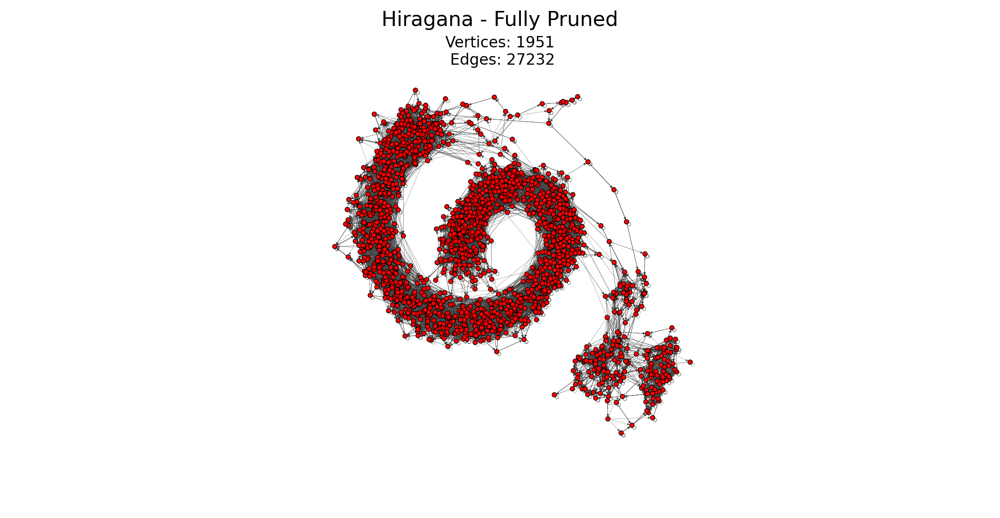

While smaller than the initial graph these state spaces are still quite large, especially when compared to the original size of the menus. For a size comparison, the two clusters in the bottom right of the above image correspond to the original hiragana menu and one other table. The following images show the state space for various paired down configurations. The "Latin" table is particularly interesting as even when direction inputs are restricted to single or diagonal button presses all of the three tables are accessible. This is clearly visible in the three distinct clusters.

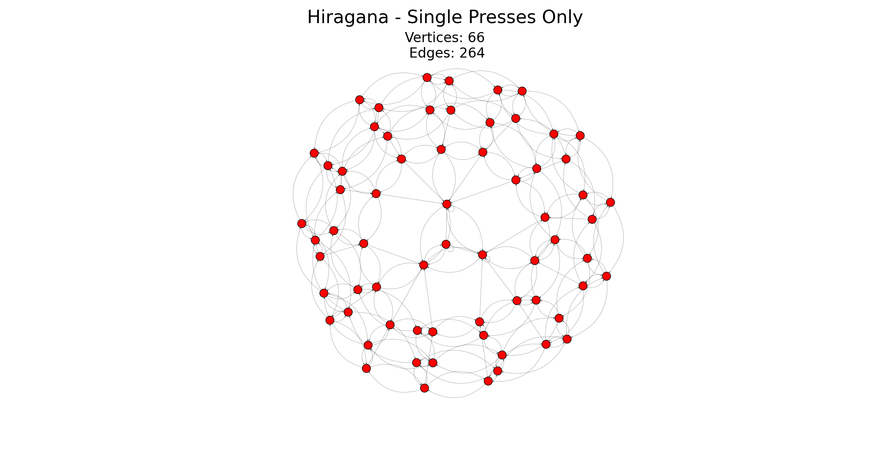
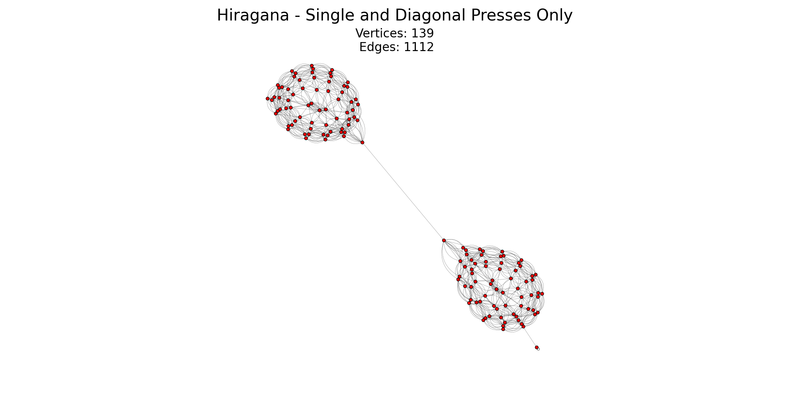
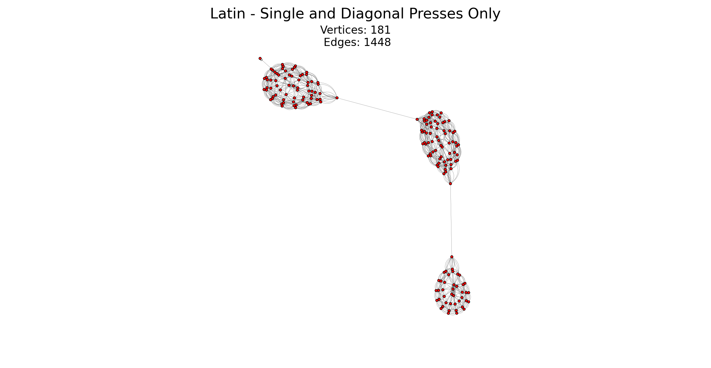


## Routing for Arbitrary Code Execution (ACE)

For the sake of this work, the process of achieving arbitrary code execution will be subdivided into three categories:

* **Gain of Function** - The series of exploits used to establish conditions conducive to ACE
* **Payload Injection** - The process of modifying existing code/data to write the code that will be executed
* **Payload Execution** - The means of hijacking execution away from the original process, redirecting to the newly written code, and returning control back to the host program without causing adverse effects

These three categories, along with the design of the payload itself, will be covered in this section. While there are, in theory, any number of routes that could be used to achieve ACE a primary route has been selected to exemplify the process. This route has been optimized for use in a Tool Assisted Speedrun (TAS) but could be modified to fit the needs of a human speederunner as well. While the routes, or series of glitches preformed to trigger the ACE, are numerous the payload itself will remain relatively static. For this reason, the theory behind the payload will be covered first followed by a routing section that covers the gain of function, injection, and finally means payload execution. The following sections contain named references to NOP-able address. More information on these address and why/how their behavior changes when NOP'd is available in the Appendix under the [Noteable NOP-able](#notable-nop-able-addresses) section.

### Crafting the Payload

To demonstrate ACE, a payload has been crafted to allow a speedrunner to skip from the first area of the game all the way to the credits without entering a single level. During a normal playthrough of the game, the player must collect a number of objects to be able to proceed to the next "Warp Room" which unlocks more games to play and thus more objects to win. Only after the player has collected enough objects are they able to enter the 4th Warp Room area and (eventually, after more object collection) fight the final boss. Normally, after winning the boss fight a short cutscene is played, followed by the credits, after which the player arrives in a secret 5th Warp Room with even harder mini-games to play. Credits are triggered merely the first time the player enters the 5th Warp Room, meaning that regardless of how the player ends up there (boss fight or not) the credits will be played upon initial entry.

Traditionally, players are prevented from warping to the next Warp Room until they defeat the boss of the current Warp Room (which itself requires object collection). However, by modifying the code responsible for this check it is possible to warp to any room regardless of progress. By warping directly to the 5th Warp Room from the first, the end credits are then triggered and the run is complete. Thus, the goal of the payload is clear: modify the function responsible for checking player progress when warping to always pass.

A **blocked** vs **unblocked** Warp Room message in the NTSC-U version:

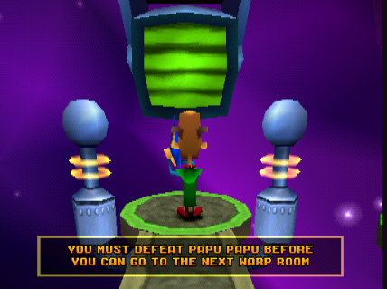
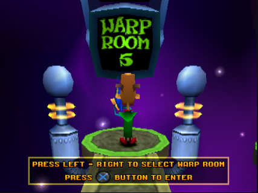

The function responsible for this check is referred to as `levelMessageCheck()`. The name comes from the fact that it is responsible for determining which message the player receives when standing on the warp pad as seen above. It takes two arguments, and returns a 4 byte value that is treated as a `bool`. Thankfully, only limited research into the arguments or other specifics of the function is required. This is due to the fact that the function provides multiple return paths, including one immediately after local variable initialization. What follows is a simplified version of `levelMessageCheck()` in C-like pseudocode:

```C
bool levelMessageCheck(uint param_1, int param_2)
{
  // variable initialization here

  // early exit check
  if ((*(uint *)(param_2 + 4) & 0x80002000) == 0x80002000) {
    return true;
  }

  do {
    // somewhat complicated logic for checking player status and updating local variables
  } while (aSentinel)

  if (complicatedConditional) {
    // an override for final boss check
    if (isFinalBoss) {
      return finalBossConditional;
    }

    return canEnterConditional;
  }

  return false;
}
```

Taking an in-depth look at the underlying assembly (shown below) a single instruction sticks out. The instruction in question: `bne v0, v1, LAB_8007b554` at address `0x8007b544`. It is responsible for branching, or changing the flow of execution, when: `((param_2 + 4) & 0x80002000 != 0x80002000)`. If this single instruction was removed then the function would always return early with a value of `true` regardless of provided arguments.

```assembly
; start of levelMessageCheck at 0x8007b534
lui     v1, 0x8000            ; the following instructions are prepping for the early exit check
lw      v0, 0x4(a1)
ori     v1, v1, 0x2000
and     v0, v0, v1
                              ; the following instruction should be NOP'd
bne     v0, v1, LAB_8007b554  ; early exit check - branch if not equal/true
                              ; the previous instruction should be NOP'd
_move   t3, a0
jr      ra                    ; jump to the address stored in $ra (this is the return)
_li     v0, 0x1               ; branch delay slot gets run before jump to set the return value to 1 in v0
```

Therefore, the goal of the payload is clear. The instruction at address `0x8007b544` is to be NOP'd. This will result in the `levelMessageCheck()` function always returning `true`, which will in turn let the player skip from the first Warp Room to the last and trigger the credits to play. In an ideal world, this would likely take three instructions. Two to initialize a register with the address `0x8007b544` and one to store $r0 at that address. Unfortunately, as will be covered in the routing section, things are not always that simple.

### Primary Route

With the foundational groundwork of the previous sections established, it is finally possible to convert theory into a practical ACE route. The following is an in-depth analysis of the route used in the TAS released alongside this work. This route uses ACE in _Crash Bash_ to skip to the final credits in roughly 1 minute and 45 seconds after boot with the menuing itself taking only ~1200 frames or 20 seconds.

#### Gain of Function

The route begins as the player first gains control of the character and enters the "Enter Name" menu used to name a game save. The currently loaded character table is switched from the default "Hiragana" to the "Katakana" table which enables access to cursor indices, and by extension NOP-able addresses that are not available with the default table. The cursor is then navigated to the index the corresponds to **NOP Bifurcation**. With two addresses now being NOP'd the cursor is navigated such that the alternate NOP, `0x00000002`, is applied activating the **Negative Starting Character Count** exploit. Next, the cursor is navigated back to the intended menu and cancels without saving, leaving the menu. The menu is re-entered with global character count being initialized to `-2,146,697,215` which results in the inserted characters being written (starting) at `0x8011b8e1`. See appendix for more details on character insertion.

With these moves the player is now able to insert a practically unlimited number of characters of their choosing. While the exact nature of this region is unknown, it is believed to be a data region (as opposed to code) related to graphics which is only used outside the save game menu. Importantly, this region is relatively safe to use and entirely static during menuing. This makes it an ideal region for payload injection as there is no risk of corrupting the game nor the payload being overwritten.

#### Payload Injection

As the player re-enters the "Enter Name" menu the cursor location and table are reset to `0` and "Hiragana" respectively. Given the wide open and relatively safe area provided by the previous menuing it is now time to write the code that will eventually be executed. This phase of the ACE route represents roughly half of the character insertion and state space navigation. Before covering the individual cursor movements, this section will first focus on the construction and challenges of writing the payload itself.

As a result of the practical limits imparted by the state space not every character is available. At the time of writing only 159/256 characters are available (full list in the Appendix). Additionally, not all of these characters are available in each character table meaning potentially costly table switching may be required. Given the reduced set of characters available for character insertion there are a limited number of op codes and operands available when writing machine code. For this reason, the payload has to be carefully crafted with certain instructions being avoided and limitations placed on the immediate values that can be used. Despite these limitations, the following payload was crafted to NOP out `0x8007b544`.

The payload is as follows:

```assembly
; code to NOP out the desired addr aka make the level check function always return True/1
0x3942b5ba  ; xori v0, t2, 0xb5ba   ; v0 = 0x0000b5ba
0x03823020  ; add  a2, gp, v0       ; a2 = 0x8007b48a
0xacca00ba  ; sw   t2, 0x00ba(a2)   ; 0x8007b544 = 0
0x03E8E888  ; jr   ra               ; jump back to the value stored in the return address register
```

This codes uses a number of tricks to achieve the desired effect while working within the state space limitations. First, `v0` is initialized to a specific value using the fact that `0 XOR A == A`. This also relies on the assumption that register `t2` is currently `0`. Next, the global pointer register `gp` is used. It just so happens to be static and initialized to `0x8006fed0`, which provides a convenient starting point for crafting the address of interest. Register `gp` is summed with the already initialized `v0` to produce an intermediate address, stored in `a2`, for use in the final instruction. Finally, the "store word" instruction is used to write `t2` (still assumed to be 0) to `0x8007b544`. The final address is crafted using an immediate value provided as an offset from the intermediate address stored in `a2`. In this way it is possible to NOP out the address of interest that would otherwise be both out-of-range and unaligned with the regular means of NOP-ing covered in previous sections.

The final piece of the payload puzzle is the return statement. The intention is to treat the payload as a function and to execute it by simply calling it. Thus, a return statement must be provided lest the processor go careening off attempting to execute stale polygon data. However, the limitations of the characters available again poses a problem. If one was to ask a MIPS assembler to convert `return` or, more specifically, `jr $ra` into machine code it would provide `0x03e00008`. Unfortunately, the character `0x08` is not available for insertion in the current state space. Thankfully, only the top 11 and bottom 6 bits of the 32 bit word for the `jr $ra` instruction are necessary (for more on op code encoding [click here](https://psx-spx.consoledev.net/cpuspecifications/#cpu-opcode-encoding)). This means an equivalent translation of this assembly instruction can be written as `0x03e8e888` since the top 11 bits are covered with `0x03e` and the bottom 6 are covered with `0x88`. This also cuts down on time lost when navigating between characters.

Before writing the above code, the character insertion location must be word aligned. All instructions must begin on a 4 byte boundary meaning, essentially, all instructions must begin on an address that ends in either `0x00`, `0x04`, `0x08`, `0x0C`. Given that character insertion is currently at `0x8011b8e1`, 3 characters must be added to align the first `xori` instruction at `0x8011b8e4`. After the alignment, the cursor as navigated through the state space to each character of interest starting with the `0xBA` of the `xori` instruction and ending with the `0x03` of the `jr` instruction. Finally, four more characters are added after the jump instruction. These act as padding to prevent against executing an invalid instruction. The risk is that because the PS1's R3000 CPU implements pipelining the instruction following a branch (or load/store as well in the R3000's case) will be executed. For more information see the delay slot entry on [Wikipedia](https://en.wikipedia.org/wiki/Delay_slot#:~:text=The%20branch%20delay%20slot%20is,its%20way%20through%20the%20pipeline.).

#### Payload Execution

The payload is now in place starting at `0x8011b8e4` and ready to be executed. However, with the next characters being inserted after the newly written code still in a data section there is no way to trigger the payload's execution. To do this, an entry point must be found where execution can be stolen from the main path of execution and gracefully returned. To accomplish this, another NOP must be deployed, this time to the **Modified Character Write Location** address. This will change the new character insertion location to the `0x800c0000` region which, after covering a bit more background information, will provide ample opportunity to execute the payload.

In order to detail exactly how payload execution will be achieved, one final bit of functionality must be re-examined: character/text animation. Recall the `enterNameMenu` function writes to a `0x00000002` to a specific byte on `168` byte boundaries to mark whether or not a character should be animated. These writes are essentially modifying something that could be called the `animationFlag`, which is a member of a `168` byte struct that will be referred to as an `AnimationNode`. Little research effort has been expended to understand the true purpose and overall structure of the `AnimationNode`, but what is known is of the utmost importance to this ACE route. Below is a summary of what is known about the form of this struct.

```C
// a rough approximation of the struct that is 168 bytes in length
struct AnimationNode {
    // many unknown members
    // following member is 0x54 or 84
    void (*fPtr)(AnimationNode_t *animNode, undefined4* param_2, undefined4* param_3);
    uint32_t* unknownPtr; // unknown but is always 0x8001cd40
    AnimationNode* nextNode; // Pointer to the next node in the (linked) list
    uint32_t[8] unknownBlock
    uint32_t animationFlag; // 0x00000002 if this character is to be animated, else 0
    // some more unknown members
};
```

In memory, a single `AnimationNode` within the linked list looks like this:
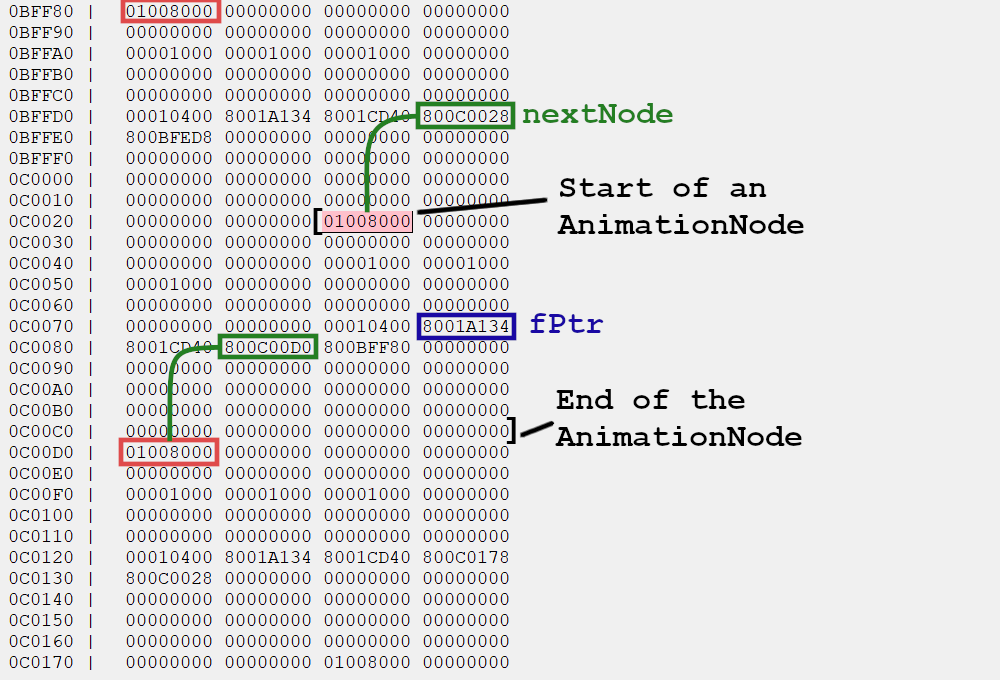


As outlined above, the `AnimationNode` appears to be a node in a linked list that contains a variety of information including a **function pointer**. Looking into the memory, it appears these nodes start at `0x800bb6a8` and run until roughly `0x800c1000`. What's more, these function pointers get called _every frame_. The cherry on top is that when **Modified Character Write Location** is used in conjunction with **Negative Starting Character Count** this will result in characters being written to the `0x800c0000` region. _This_ is how execution can be stolen from the intended path, by modifying an existing function pointer to have it point to the newly written code at `0x8011b8e4`.

Despite this jackpot-winning stroke of luck, the ultimate solution will not come easy. Unless the function pointer (`fPtr`) is `null` it will be called every single frame. Since only a single character can be inserted/modified every frame, this means all 4 bytes must be modified in an order such that each configuration results in a valid function pointer. Unfortunately, modifying `0x8001a134` one byte at a time starting at `0x34` and working towards `0x80` while building `0x8011b8e4` just isn't possible. The first intermediate address `0x8001a1e4` starts execution smack dab in the middle a function that allocates memory on the stack. Since the function was entered abnormally, the stack pointer was not decremented. Thus, as soon as the function is exited the stack pointer is incremented. This increase (without a matching decrease) causes stack corruption which quickly results in the game crashing.

Obviously, a bit more tact will be required. Numerous other theories were crafted in an attempt to route this ACE, however, a solution was eventually found. The trick is to write the function pointer in its entirety _before_ allowing it to be called. This is a multi-step process but the general idea is as follows:

1. Find an accessible location to write a new `fPtr`
2. Craft a new `AnimationNode`, such that `fPtr` is in the correct location
3. Ensure the corresponding `nextNode` pointer is valid (Note `0x00000000` is valid as it marks the end of the list)
4. Modify the `nextNode` of a valid `AnimationNode` to point to this new crafted `AnimationNode`
5. Payload is executed and safely exits as the new `AnimationNode` marks the end of the list

In conclusion, the final movements after code injection are as follows. Switch the character table to "Katakana" and navigate to **Modified Character Write Location**. Insert 36 bytes starting at `0x800c0030` moving the cursor to `0x800c0054` where the new function pointer `0x0011b8e4` will be crafted (recall `0x00000000` is mirrored to `0x80000000`). With the new `fPtr` written, continue writing `0x00` through the corresponding `nextNode` field until reaching the `fPtr` of the existing `AnimationNode` (referenced in step 4 above). Passing through this function pointer without modifying it is unfortunately not possible given the restricted characters in the existing state space. Thankfully, since it does not matter what code is run (as long as it is benign) sneaking through this function pointer is much easier. The function pointer is modified to be `0x00035134` which has no adverse effects (with respect the to ACE). What code is run as a result of character insertion on each tick is left as an exercise for the reader.

Four more `0x00`s are written passing through `unknownPtr` and the insertion arrives right before the `nextNode` of a currently in-use node. With the current value of `nextNode` at `0x800c00d0` a single character insertion is needed to change it to `0x800c000` pointing it at the newly crafted `AnimationNode`. This triggers the execution of the payload every tick. The instruction at `0x8007b544` is NOP'd and it is finally time to leave the menu. Given the cursor's current location it is quicker to leave using an alternate cancel button at index `-70`. Once the player is back in the Warp Room, it's as simple as navigating to the teleporter, selecting "Warp Room 5" and waiting for the credits to roll.

The final state of the two memory regions:
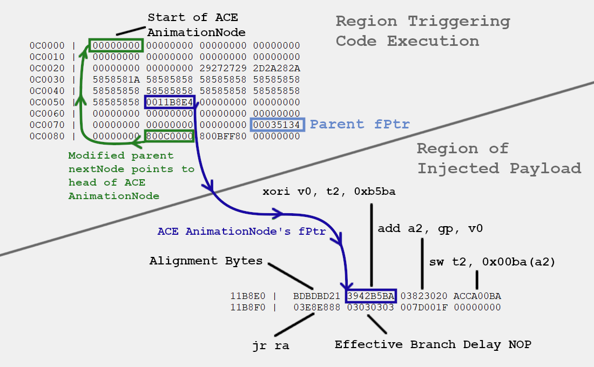

## Conclusion and Future Work

This work has provided an in-depth examination of the mechanics behind the "Enter Name" menu memory manipulation glitch in **Crash Bash**. This knowledge was then leveraged to implement a method for arbitrary code execution using only controller inputs. The ACE was then used to implement an any% route to skip to the credits as fast as possible. The specifics behind the route used in the accompanying TAS were explained, along with some of the challenges encountered and the luck and tricks used to overcome these challenges.

While this represents a significant improvement in the TAS any% category, it is certainly not the most optimal route possible. Looking only at the current method that uses ACE, equivalent code could be written to achieve similar behavior with fewer inputs by optimizing byte selection. The current implementation uses a greedy nearest-neighbor search for the next byte in the assembly without caring for any previous or future bytes. While planning the most optimal route between all possible bytes is almost assuredly an NP-hard problem, with even moderate effort frame improvements seem likely. This is to say nothing of alternate routes which may or may not use ACE to implement a credit skip. The code provided in the [tools](../tools/) section (with a little cleanup) could be of great use in exploring alternate options for a credit skip.

Looking beyond the TAS %any category, it is the hope of this author that the techniques demonstrated here can be applied to the human speedrunning category: _any% Memory Manipulation_ which allows runners to use the existing glitch to beat the game as fast as possible. While the existing route _could_ be used, it is optimized for a computer and human players may find it difficult to press 2, 3, and even 4 buttons simultaneously so frequently. Ideally, instead of focusing on reducing the number of inputs, a human route would focus on making the inputs as easy as possible for the runner, even at the cost of time. One way to achieve this would be by implimenting a weighted graph of the state space used for generating routes. The weight of the edges would correspond to the difficulty for the runner to press a given combination of buttons. By having the least costly root correspond to the most human feasible root, it seems plausible a human player could bring the _any% Memory Manipulation_ route from 54:35 down to a handful of minutes.

## Appendix

### Notable NOP-able Addresses

Having established a way to verify to which addresses it is possible to safely navigate, below is an incomplete list of addresses that can practically be NOP'd and their effects. A subset of these addresses can be combined in various ways to create situations which allow for arbitrary code execution which will be analyzed in a later section. It is important to note that since the `enterNameMenu` (and other code/data) is located at slightly different addresses in the NTSC-U and PAL versions, the following NOP addresses are **only** valid for NTSC-J and will not work for any other version.

#### NOP Bifurcation -> `0x800b7e0c`

Unquestionably the single most important address that can be NOP'd within the scope of this work, named NOP bifurcation, NOP-ing this address effectively results in a second NOP being written to an alternate location. As described above, throughout the course of `enterNameMenu` in order to track animation a `0x00000000` is first written to a location dependent on the current cursor location with a `0x00000002` being written to a similar location at the end of the function after the cursor location has been updated. The address to which the `0`/`2` is written can be determined using the following approximation in C: `(&cursorTable + cursorIndex * 0xa8) = 0;`. This however does not tell the full story as, crucially, the `0xa8` is a **computed** constant, meaning it's value is dependent on a series of `asm` instructions. The following is how this `0xa8` is computed in the original MIPS assembly.

```assembly
; starting at 0x800b7df8
lw      t0, offset cursorIndex(s1)  ; load t0 with the current cursor location (cursorIndex)
lw      a0, offset curCharTable(v1) ; not relevant but included for spacing/accuracy
sll     v0, t0, 0x2                 ; store into v0 the current cursor location multiplied by 4
addu    v0, v0, t0                  ; add the cursor location to v0
sll     v0, v0, 0x2                 ; multiply v0 by 4
                                    ; the following address can be NOP'd
addu    v0, v0, t0                  ; add the cursor location to v0
                                    ; the above address can be NOP'd
sll     v0, v0, 0x3                 ; multiply v0 by 8
addu    v0, v0, a1                  ; add &cursorTable to v0 | completing computation
sll     v1, a0, 0x2                 ; not relevant
addu    v1, v1, a0                  ; not relevant
sll     v1, v1, 0x2                 ; not relevant
sw      zero,0x7c(v0)               ; store 0 at v0 aka (&cursorTable + cursorIndex * 0xa8)
```

As seen above, `0xa8` is not a stored constant but computed by a series of multiplications and additions. When the instruction `add v0, v0, t0` is overwritten with `0x00` this addition is no longer performed and thus the `0` for tracking animation is written into a different location as specified by `v0`. Additionally, since a the code responsible for writing the `2` for tracking animation is duplicated in a separate area in the function the `2` is still written to the intended location. Thankfully, `0x2` also, effectively results in a NOP. Meaning, NOPs can effectively be written simultaneously in two different locations dependent on the current location of the cursor.

#### Negative Starting Character Count -> `0x800b83e4` (Requires Bifurcated NOP)

Every time the player navigates to the "Enter Name" menu an initialization function is first called. This function, referred to as `initEnterNameMenu`, is responsible for preparing the data associated with the "Enter Name" menu before the function is called as part of the main loop. Namely, one feature this function provides is initializing where the next character inserted into the name will be placed. This is slightly non-trivial as the game will remember the characters last entered into the name field. i.e. if a player entered "NAME", left the menu, and re-entered "NAME" would still be displayed with the next character being placed at index four just after the "E". The following C code starts by initializing the global character counter `nameCharCounter` to `16` and copying that into a temporary local variable `lNameCharCounter`. The code loops through the characters used to name the game save, starting from the last possible character counting down to the first, and exits only when a finding a character that is not `0x20` aka a space.

```C
nameCharCounter = 0xf;
lNameCharCounter = nameCharCounter;

do {
    nameCharCounter = lNameCharCounter;
    lNameCharCounter = nameCharCounter - 1;
    if (*(char *)((int)&gameSaveNameString + nameCharCounter) != ' ') goto handleEndOfName;
} while (0 < lNameCharCounter);
```

The matching assembly used to initialize `nameCharCounter` to `0xf` is as follows with the NOP-able address surrounded with comments.

```assembly
; starting at 0x800b83dc
lui     v0, 0x800c                          ; load 0x800c0000 into v0 aka lNameCharCounter
sw      zero, -0x4960(v0)=>saveStateMachine ; unrelated to NOP behavior
                                            ; the following address can be NOP'd
li      v0, 0xf                             ; load lNameCharCounter with 0xf
                                            ; the above address can be NOP'd
sw      v0, offset nameCharCounter(a0)      ; store lNameCharCounter into nameCharCounter
```
By NOP-ing out the instruction responsible for initializing `lNameCharCounter` instead of being `0xf` it will be whatever value was last in `v0`. Thankfully, this is entirely deterministic as `v0` is initialized just two instructions before in preparation for use in a store word instruction. `lNameCharCounter` will begin as `0x800c0000` which, when interpreted as a signed integer is a negative. Consequently, the `while` loop is promptly exited leaving `nameCharCounter` at `0x800c0000` which is then incremented by one in subsequent initialization code leaving the global `nameCharCounter`, at `0x800c0001` or `-2,146,697,215`.

#### Modified Character Write Location -> `0x800b7d64`

When the user requests a character be inserted, in the NTSC-J version, a separate function is called that is responsible for potentially adding another character to the name. This function, referred to as `insertCharacter`, preforms all the necessary checks to see if a character can be added or if it should result in modifying the current character. The details of these checks have been covered in **Inserting Characters in NTSC-J** section above, but in the most likely event (a single new character `inputChar` is to be added) then the following code will be run to place it at the end of the current name string:

```C
*(byte *)((int)&gameSaveNameString + nameCharCounter) = inputChar;
```

As the title suggest, the NOP available at this location modifies the address to which `inputChar` is stored. Again taking a look at the assembly, this is another case of a stale register being used, specifically `v0`.

```assembly
; starting at 0x800b7d54
lui     v1, 0x8006                       ; initialize v1 (nextCharIndex) to 0x80060000
lui     s0, 0x800c                       ; not directly relevant
lw      v0, offset nameCharCounter(s0)   ; load into v0 the number of currently displayed characters
addiu   v1, v1, -0x4738                  ; finish initializing v1 to 0x8005b8c8 (shortly before name string)
                                         ; the following address can be NOP'd
addu    v0, v0, v1                       ; add the nextCharIndex to the "base" address of the name string
                                         ; the above address can be NOP'd
sb      t1, 0x18(v0)=>gameSaveNameString ; store t1 (inputChar) at v0 (name string addr + displayed chars)
```

Instead of being re-initialized by an addition, `v0` will remain the number of characters currently displayed on the screen. This value starts at `0` and can be a maximum of `16`. Given the `sb` or store byte instruction actually stores at `v0` plus an offset of `0x18` this means that if this address is NOP'd the first character will be inserted at `0x00000018`. This is right in the middle of the `0x30` byte "Unused/Reserved" field of the BIOS as detailed by [psx-spx.github.io](https://psx-spx.consoledev.net/kernelbios/#bios-memory-allocation).

#### Alternative "up" Movement -> `0x800b7ee4` (Requires Bifurcated NOP)

While not currently used in any ACE route, this NOP provides an interesting mix of utility and draw backs. Another example of a stale register value being used, this one changes the offset applied when the "up" direction is pressed.

```C
cursorIndex = cursorIndex + charTableAddr[lCursorIndex].upMove;
```

```assembly
; starts at 0x800b7ed0 where the "up" movement check is performed
beq     v0, zero, LAB_800b7f04      ; branch away if "up" is not pressed
_li     a0, 0x190
clear   a1
move    a2, a1
li      a3, 0x1000
                                    ; the following address can be NOP'd
lb      t0, 0xc(s0)=>DAT_800bb064   ; load the "up" movement offset into t0 (0xc is the offset of upMove)
                                    ; the above address can be NOP'd
lw      v1, offset cursorIndex(s1)  ; load into v1 the current (global) cursorIndex
li      v0, 0x1e00
sw      v0, local_18(sp)
sw      zero, local_14(sp)
addu    v1, v1, t0
jal     uiMultiUpdate
_sw     v1, offset cursorIndex(s1)  ; store v1 at the cursorIndex address
```

The above code covers the the immediate effect, but doesn't not cover the possible values for `t0` and thus the resulting movements. While an in-depth analysis of the why behind the various potential values of `t0` is outside the scope of this work, the values themselves and means of achieving them is as follows:

* In the event only "up" is pressed this tick `t0` is the current `cursorIndex`
  * This effectively doubles the current `cursorIndex` when the `addu v1, v1, t0` is preformed. Note, this is subject to over/underflow.
* In the event "up" is pressed along with "left" or "right" `t0` will be `-1`

Given that there are a limited number of memory locations to which the cursor can be navigated nominally this NOP provides alternate routes to the same or similar addresses. This can be increasingly important when trying to avoid "dangerous" areas of memory that, if NOP'd, can cause a game crash. Finally as will be discussed in the ACE section, this alternate movement affords more bytes available for writing code at the cost of further complicating movement.

#### Disabled "Left" Movement -> `0x000b7e44`

While the previous NOP-able addresses are all potentially advantageous, this address has been included as it more often than not best avoided. This address simply results in the check responsible for determining if "left" was pressed to always fail. This is the result of `v0` never being loaded with the controller state and instead always stuck at `0x80050000`. While NOP-ing this address is "safe" it is best avoided as it removes roughly a quarter of all potential movement options.

```C
  if ((controllerState1 & 0x80) != 0) {
    cursorIndex = lCursorIndex + charTableAddr[lCursorIndex].leftMove;
    // handle UI update function
  }
```

```assembly
; starting at 0x800b7e38
lui     v0, 0x8005                      ; load into v0 0x8005000 to setup s2 (for controllerState1)
addiu   s2, v0, 0x2140                  ; load into s2 the value v0 + 0x2140
lw      v1, 0x0(v1)                     ; unrelated
                                        ; the following address can be NOP'd
lw      v0, 0x48(s2)=>controllerState1  ; load controllerState1 into v0
                                        ; the above address can be NOP'd
nop                                     ; load delay nop
andi    v0, v0, 0x80                    ; mask away all bits but the "left" bit and store in v0
beq     v0, zero, LAB_800b7e84          ; branch away from "left pushed" handling code if "left" isn't pressed
```

### Character Insertion Logical

As covered in the main portion of this work, normally characters are inserted starting at `gameSaveNameString` or `0x8005b8e0` and an offset for the write location is applied based on the number of currently displayable characters. The offset is referred to below as `nameCharCounter` as it is a count of the **total** number of characters in the name (not number of displayed characters). Recall the code below:

```C
*(byte *)((int)&gameSaveNameString + nameCharCounter) = inputChar;
```

```assembly
; starting at 0x800b7d54
lui     v1, 0x8006                       ; initialize v1 (nextCharIndex) to 0x80060000
lui     s0, 0x800c                       ; not directly relevant
lw      v0, offset nameCharCounter(s0)   ; load into v0 the number of currently displayed characters
addiu   v1, v1, -0x4738                  ; finish initializing v1 to 0x8005b8c8 (shortly before name string)
                                         ; the following address can be NOP'd
addu    v0, v0, v1                       ; add the nextCharIndex to the "base" address of the name string
                                         ; the above address can be NOP'd
sb      t1, 0x18(v0)=>gameSaveNameString ; store t1 (inputChar) at v0 (name string addr + displayed chars)
```

When the **Negative Starting Character Count** address is NOP'd then `gameSaveNameString` becomes `0x800c0001` (after re-entering the menu). Thus, when the `addu v0, v0, v1` line is executed it is equivalent to `v0 = 0x800c0001 + 0x8005b8e0 == 0x0011b8e1`. This is the location to which the payload is written in the main route. Building on this, when the **Modified Character Write Location** address is NOP'd the `addu v0, v0, v1` line is no longer run. Due to the stale `v0` which was previously initialized to `nameCharCounter`, writes will now happen at `nameCharCounter + 0x18`. This is the result of the final `sb` (store byte). Since `nameCharCounter` is `0x800c001` writes now start at `0x800c0019` plus however many characters have been written. By dynamically NOP-ing out these address it is therefore possible to write the payload in one region and the supporting structure for executing it in another.

### Annotated Inputs

An abridged version of the inputs needed for this route. Inputs that are held for an extended period of time are only given a single row entry. This really only applies to moving the player character in and out of the menu.

```
|-----------------------------|
| Table Change: hira
|-----------------------------|
| move |  from |  to   | byte |
|------|-------|-------|------|
| UDR  |     0 |    66 |      |
|-----------------------------|
| Table Change: kata
|-----------------------------|
|      |       |       |      |
|      |       |       |      | Traveling to NOP the "NOP Bifurcation" address
| UDR  |    66 |    61 |      |
| UL   |    61 |    47 |      |
| ULR  |    47 |    33 |      |
| UL   |    33 |     6 |      |
| UDLR |     6 |    71 |      |
| DR   |    71 |   -57 |      |
| LR   |   -57 |   -70 |      |
| DLR  |   -70 |   -75 |      |
| UR   |   -75 |   -87 |      |
|      |       |       |      | Traveling to alt NOP the "Negative Starting Character Count" address
| DR   |   -87 |   -73 |      |
| DR   |   -73 |   -71 |      |
| ULR  |   -71 |   -82 |      |
| UDL  |   -82 |   -87 |      |
| UR   |   -87 |   -99 |      |
| UDL  |   -99 |   -61 |      |
| UDL  |   -61 |     3 |      |
| UDLR |     3 |    68 |      |
| U    |       |       |      | Exit the save menu
| U    |       |       |      | Walk towards the save menu
| U    |       |       |      | Enter save menu
|      |       |       |      | Wait to be able to go through the final menu
|-----------------------------|
| Table Change: hira
|-----------------------------|
|      |       |       |      |
|      |       |       |      | Injecting Payload
| UDLR |     0 |    78 |      |
| DR   |    78 |    92 |      |
| DR   |    92 |   106 |      |
| O    |       |       | 0xBA |
| UDL  |   106 |   105 |      |
| O    |       |       | 0xB5 |
| DR   |   105 |   119 |      |
| UDR  |   119 |   111 |      |
| ULR  |   111 |    98 |      |
| ULR  |    98 |    85 |      |
| ULR  |    85 |    72 |      |
| UDR  |    72 |   138 |      |
| UDLR |   138 |   203 |      |
| UDL  |   203 |   214 |      |
| ULR  |   214 |   298 |      |
| UDLR |   298 |   407 |      |
| LR   |   407 |   423 |      |
| UL   |   423 |   360 |      |
| ULR  |   360 |   185 |      |
| DLR  |   185 |   -56 |      |
| DR   |   -56 |   -55 |      |
| UDL  |   -55 |   -40 |      |
| L    |   -40 |   -41 |      |
| O    |       |       | 0x42 |
| UDL  |   -41 |    -3 |      |
| UDR  |    -3 |    -7 |      |
| O    |       |       | 0x39 |
| UDLR |    -7 |   -16 |      |
| DL   |   -16 |     8 |      |
| DL   |     8 |    20 |      |
| O    |       |       | 0x20 |
| UR   |    20 |     8 |      |
| UDLR |     8 |    73 |      |
| UDLR |    73 |   138 |      |
| UDLR |   138 |   203 |      |
| UDL  |   203 |   214 |      |
| ULR  |   214 |   298 |      |
| UDLR |   298 |   407 |      |
| LR   |   407 |   423 |      |
| DL   |   423 |   365 |      |
| DLR  |   365 |   381 |      |
| DR   |   381 |   192 |      |
| DLR  |   192 |    -8 |      |
| UDLR |    -8 |   -16 |      |
| O    |       |       | 0x30 |
| DL   |   -16 |     8 |      |
| UDL  |     8 |    72 |      |
| L    |    72 |    71 |      |
| DL   |    71 |    83 |      |
| UDL  |    83 |    82 |      |
| O    |       |       | 0x82 |
| UDL  |    82 |    94 |      |
| UDL  |    94 |    93 |      |
| UL   |    93 |    79 |      |
| UDL  |    79 |   143 |      |
| UDL  |   143 |   154 |      |
| O    |       |       | 0x03 |
| UDLR |   154 |   157 |      |
| UDLR |   157 |    40 |      |
| DL   |    40 |    52 |      |
| DLR  |    52 |    78 |      |
| DR   |    78 |    92 |      |
| DR   |    92 |   106 |      |
| O    |       |       | 0xBA |
| UR   |   106 |    94 |      |
| UR   |    94 |    69 |      |
| DR   |    69 |    83 |      |
| UR   |    83 |    71 |      |
| R    |    71 |    72 |      |
| UDR  |    72 |   138 |      |
| UDLR |   138 |   203 |      |
| UDL  |   203 |   214 |      |
| ULR  |   214 |   298 |      |
| UDLR |   298 |   407 |      |
| LR   |   407 |   423 |      |
| UL   |   423 |   360 |      |
| ULR  |   360 |   185 |      |
| UDLR |   185 |  -112 |      |
| DR   |  -112 |  -240 |      |
| UDL  |  -240 |  -195 |      |
| UDLR |  -195 |  -105 |      |
| O    |       |       | 0x00 |
| UDL  |  -105 |   -32 |      |
| UDLR |   -32 |     7 |      |
| UR   |     7 |    60 |      |
| UDL  |    60 |    53 |      |
| UR   |    53 |    41 |      |
| O    |       |       | 0xCA |
| DLR  |    41 |    54 |      |
| UDLR |    54 |    52 |      |
| DLR  |    52 |    78 |      |
| ULR  |    78 |   130 |      |
| UL   |   130 |   116 |      |
| O    |       |       | 0xAC |
| DLR  |   116 |   128 |      |
| UDR  |   128 |   111 |      |
| UL   |   111 |    97 |      |
| UDL  |    97 |    96 |      |
| O    |       |       | 0x88 |
| UL   |    96 |    82 |      |
| UL   |    82 |    81 |      |
| LR   |    81 |    68 |      |
| UDLR |    68 |    62 |      |
| L    |    62 |    61 |      |
| UL   |    61 |    47 |      |
| O    |       |       | 0xE8 |
| O    |       |       | 0xE8 |
| DR   |    47 |    61 |      |
| UDL  |    61 |    52 |      |
| DL   |    52 |    77 |      |
| L    |    77 |    76 |      |
| UDLR |    76 |   154 |      |
| O    |       |       | 0x03 |
|      |       |       |      | Switching to 0x800c000 Region to setup function pointer
| UDLR |   154 |   157 |      |
| UDLR |   157 |    40 |      |
| DR   |    40 |    54 |      |
| DR   |    54 |    66 |      |
|-----------------------------|
| Table Change: kata
|-----------------------------|
|      |       |       |      |
| UDR  |    66 |    61 |      |
| UL   |    61 |    47 |      |
| ULR  |    47 |    33 |      |
| UL   |    33 |     6 |      |
| UDLR |     6 |    71 |      |
| DR   |    71 |   -57 |      |
| LR   |   -57 |   -70 |      |
| DLR  |   -70 |   -75 |      |
| ULR  |   -75 |   -88 |      |
|      |       |       |      | Moving to new AnimationNode function pointer
|      |       |       |      | Writing new AnimationNode function pointer
| UR   |   -88 |  -100 |      |
| UDR  |  -100 |   -60 |      |
| ULR  |   -60 |    -8 |      |
| O    |       |       | 0xE4 |
| UDL  |    -8 |   -17 |      |
| DLR  |   -17 |     9 |      |
| R    |     9 |    10 |      |
| R    |    10 |    11 |      |
| O    |       |       | 0xB8 |
| R    |    11 |    12 |      |
| LR   |    12 |    -1 |      |
| UDL  |    -1 |    -5 |      |
| ULR  |    -5 |   -44 |      |
| ULR  |   -44 |   -70 |      |
| DLR  |   -70 |   -75 |      |
| UDL  |   -75 |   -86 |      |
| ULR  |   -86 |  -112 |      |
| U    |  -112 |  -196 |      |
| DLR  |  -196 |  -407 |      |
| UDR  |  -407 |  -679 |      |
| LR   |  -679 |  -734 |      |
| ULR  |  -734 |  -905 |      |
| DR   |  -905 |  -881 |      |
| UDLR |  -881 | -1182 |      |
| O    |       |       | 0x11 |
| DLR  | -1182 | -1407 |      |
| UL   | -1407 | -1285 |      |
| DLR  | -1285 | -1147 |      |
| LR   | -1147 | -1049 |      |
| UDLR | -1049 |  -860 |      |
| UD   |  -860 |  -687 |      |
| ULR  |  -687 |  -675 |      |
| DL   |  -675 |  -528 |      |
| ULR  |  -528 |  -420 |      |
| L    |  -420 |  -416 |      |
| UL   |  -416 |  -316 |      |
| UDLR |  -316 |  -252 |      |
| ULR  |  -252 |  -176 |      |
| D    |  -176 |  -172 |      |
| DLR  |  -172 |  -264 |      |
| UDLR |  -264 |  -174 |      |
| O    |       |       | 0x00 |
|      |       |       |      | Moving to existing AnimationNode function pointer
|      |       |       |      | Sneaking through existing AnimationNode function pointer
| UD   |  -174 |  -110 |      |
| UDLR |  -110 |   -71 |      |
| UDLR |   -71 |   -81 |      |
| O    |       |       | 0x34 |
| UL   |   -81 |   -95 |      |
| O    |       |       | 0x51 |
| DLR  |   -95 |   -82 |      |
| UDLR |   -82 |   -86 |      |
| ULR  |   -86 |  -112 |      |
| U    |  -112 |  -196 |      |
| DL   |  -196 |  -279 |      |
| DLR  |  -279 |  -383 |      |
| O    |       |       | 0x03 |
| DLR  |  -383 |  -395 |      |
| UDL  |  -395 |  -405 |      |
| L    |  -405 |  -401 |      |
| D    |  -401 |  -416 |      |
| UL   |  -416 |  -316 |      |
| UDLR |  -316 |  -252 |      |
| ULR  |  -252 |  -176 |      |
| D    |  -176 |  -172 |      |
| DLR  |  -172 |  -264 |      |
| UDLR |  -264 |  -174 |      |
| O    |       |       | 0x00 |
|      |       |       |      | Executing Payload
| O    |       |       | 0x00 |
| UD   |  -174 |  -110 |      |
| UDR  |  -110 |   -70 |      |
| UL   |       |       |      | Walk left towards the level selector
| U    |       |       |      | Walk up into the level selector
| U    |       |       |      | Walk into the level selector and select the first option (should be 5 now)
|-----------------------------|
| Frames:  1421               |
|-----------------------------|
```

## Referenced Global Symbols for _Crash Bash_ (NTSC-J)

```
curCharTable         0x800c11d8
cursorIndex          0x800c11d4
cursorTable          0x800bb724
enterNameMenu()      0x800b7dc0
gameSaveNameStr      0x8005b8e0
initEnterNameMenu    0x800b8344
insertCharacter()    0x800b7c84
levelMessageCheck()  0x8007b534
nameCharCounter      0x800c11dc
```

### Available Characters

Given the currently know address which cause unrecoverable problems, the following is a list of all writeable bytes:

#### With use of Terminal Subgraphs - 159 Bytes

```
[0x00, 0x03, 0x0C, 0x11, 0x20, 0x30, 0x31, 0x32,
 0x33, 0x34, 0x35, 0x36, 0x37, 0x38, 0x39, 0x41,
 0x42, 0x43, 0x44, 0x45, 0x46, 0x47, 0x48, 0x49,
 0x4A, 0x4B, 0x4C, 0x4D, 0x4E, 0x4F, 0x50, 0x51,
 0x52, 0x53, 0x54, 0x55, 0x56, 0x57, 0x58, 0x59,
 0x5A, 0x6F, 0x80, 0x81, 0x82, 0x83, 0x84, 0x85,
 0x86, 0x87, 0x88, 0x89, 0x8A, 0x8B, 0x8C, 0x8D,
 0x8E, 0x8F, 0x90, 0x91, 0x92, 0x93, 0x94, 0x95,
 0x96, 0x97, 0x98, 0x99, 0x9A, 0x9B, 0x9C, 0x9D,
 0x9E, 0x9F, 0xA0, 0xA1, 0xA2, 0xA3, 0xA4, 0xA5,
 0xA6, 0xA7, 0xA8, 0xA9, 0xAA, 0xAB, 0xAC, 0xAD,
 0xAE, 0xAF, 0xB0, 0xB1, 0xB3, 0xB4, 0xB5, 0xB6,
 0xB7, 0xB8, 0xB9, 0xBA, 0xBB, 0xBD, 0xBE, 0xBF,
 0xC0, 0xC1, 0xC2, 0xC3, 0xC4, 0xC5, 0xC6, 0xC7,
 0xC8, 0xC9, 0xCA, 0xCB, 0xCC, 0xCD, 0xCE, 0xCF,
 0xD0, 0xD1, 0xD2, 0xD3, 0xD4, 0xD5, 0xD6, 0xD7,
 0xD8, 0xD9, 0xDA, 0xDB, 0xDC, 0xDD, 0xDE, 0xDF,
 0xE0, 0xE1, 0xE2, 0xE3, 0xE4, 0xE5, 0xE6, 0xE7,
 0xE8, 0xE9, 0xEA, 0xEB, 0xEC, 0xEF, 0xF0, 0xF1,
 0xF2, 0xF3, 0xF4, 0xF5, 0xF6, 0xF7, 0xF8]
```

#### Without use of Terminal Subgraphs - 157 Bytes

Bytes `0x0C` and `0xBF` have been lost

```
[0x00, 0x03, 0x11, 0x20, 0x30, 0x31, 0x32, 0x33,
 0x34, 0x35, 0x36, 0x37, 0x38, 0x39, 0x41, 0x42,
 0x43, 0x44, 0x45, 0x46, 0x47, 0x48, 0x49, 0x4A,
 0x4B, 0x4C, 0x4D, 0x4E, 0x4F, 0x50, 0x51, 0x52,
 0x53, 0x54, 0x55, 0x56, 0x57, 0x58, 0x59, 0x5A,
 0x6F, 0x80, 0x81, 0x82, 0x83, 0x84, 0x85, 0x86,
 0x87, 0x88, 0x89, 0x8A, 0x8B, 0x8C, 0x8D, 0x8E,
 0x8F, 0x90, 0x91, 0x92, 0x93, 0x94, 0x95, 0x96,
 0x97, 0x98, 0x99, 0x9A, 0x9B, 0x9C, 0x9D, 0x9E,
 0x9F, 0xA0, 0xA1, 0xA2, 0xA3, 0xA4, 0xA5, 0xA6,
 0xA7, 0xA8, 0xA9, 0xAA, 0xAB, 0xAC, 0xAD, 0xAE,
 0xAF, 0xB0, 0xB1, 0xB3, 0xB4, 0xB5, 0xB6, 0xB7,
 0xB8, 0xB9, 0xBA, 0xBB, 0xBD, 0xBE, 0xC0, 0xC1,
 0xC2, 0xC3, 0xC4, 0xC5, 0xC6, 0xC7, 0xC8, 0xC9,
 0xCA, 0xCB, 0xCC, 0xCD, 0xCE, 0xCF, 0xD0, 0xD1,
 0xD2, 0xD3, 0xD4, 0xD5, 0xD6, 0xD7, 0xD8, 0xD9,
 0xDA, 0xDB, 0xDC, 0xDD, 0xDE, 0xDF, 0xE0, 0xE1,
 0xE2, 0xE3, 0xE4, 0xE5, 0xE6, 0xE7, 0xE8, 0xE9,
 0xEA, 0xEB, 0xEC, 0xEF, 0xF0, 0xF1, 0xF2, 0xF3,
 0xF4, 0xF5, 0xF6, 0xF7, 0xF8]
```

### Alternate Route(s)

While the route covered in this work represents the most optimal route for a Credits Warp currently known, there are a number of other potentials routes that have been or could be explored. The following are two of such routes with the former having been implemented but deemed to costly and the latter never fully realized.

#### Payload at `0x800c0030`

Instead of storing the payload in a separate location, this route injects the payload in the current `AnimationNode` and then modifies it's function pointer to point back to the injected code. This is achieved by first NOP-ing out the **NOP Bifurcation**, **Negative Starting Character Count**, and **Modified Character Write Location** addresses. The menu is then left and re-entered placing the new write location at `0x800c0019`. Padding is inserted until reaching the code injection location at `0x800c0034`. The payload from the main route is written minus the return and matching delay slot NOP. Before the return command can be written additional code must be added.

The additional code at the end of the payload is to mitigate and issue related to limitations of navigating the state space. In order to execute code at `0x800c0030` the existing function pointer must be changed to `0x800c0034` from `0x801a134`. The perquisite bytes `0x34` and `0x00` are in the default state space, but in order to get to a `0x0c` a traversal into a terminal subgraph is required. Meaning the`0x0c` can be reached and inserted, triggering the code execution, but once there it's not possible to get back the cursor back to a location to exit the menu. To resolve this, the new code will write `0x00000002` to the address `0x800bb6a0`. This address corresponds to the current state of the "Enter Name" menu state machine. Specifically, this value corresponds to the "exit" state which means as soon as the code is executed the menu is exited without requiring any user input. Once the additional code is written, the return and delay slot are added. Padding is then added to reach the function pointer which is modified to the value specified above. This triggers the execution and boot the player back to the Warp Room with the payload being executed a single time and the desired address NOP'd.

#### Kernel/BIOS Region Modification

Early on in research it was discovered that NOP-ing only the **Modified Character Write Location** would allow the player to write bytes starting at `0x00000018` which is where the BIOS is copied and (it appears) the [ISR](https://en.wikipedia.org/wiki/Interrupt_handler) lives. Depending on the BIOS used, the is an amount of room from `0x18` to `0x80` where code could conceivably be written. There exists three instructions starting at `0x80` which get run extremely frequently (multiple times a "tick") from which the execution could be stolen and used to point back at the code starting at `0x18`.

Despite the promise of this initial idea, it was never implemented. The limited number of bytes available made it difficult to "sneak through" the earlier instructions to arrive at more desirable ones. This was made worse by the fact the code was run every tick meaning every iteration had to be valid similar to the function pointer in the primary route. However, the final nail in the coffin was the difficulty inability to insert more than eight bytes at a given time. A NOP path was conceived to mark a regular character as a (han)dakuten character which would allow that character to be inserted an unlimited number of times making cursor movement easier. While the route is theoretically possible it caused unrecoverable run-time errors on *Bizhawk* and was never tested with hardware in the loop.
